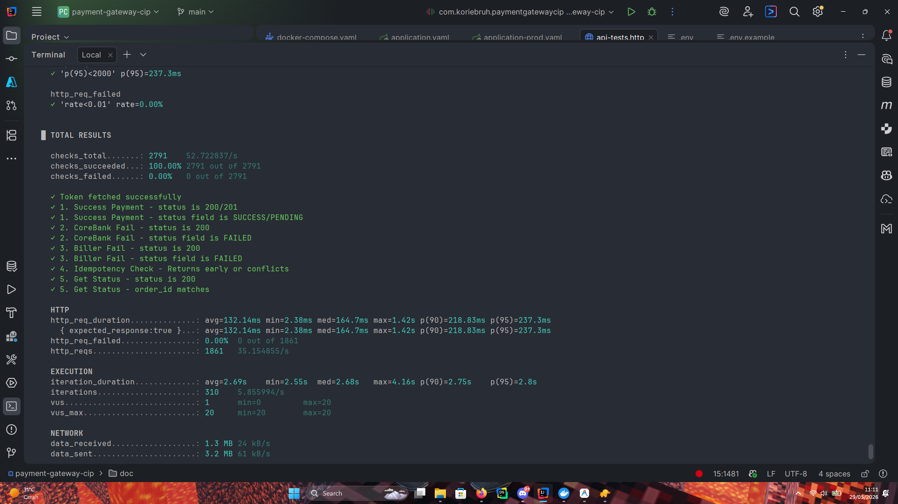
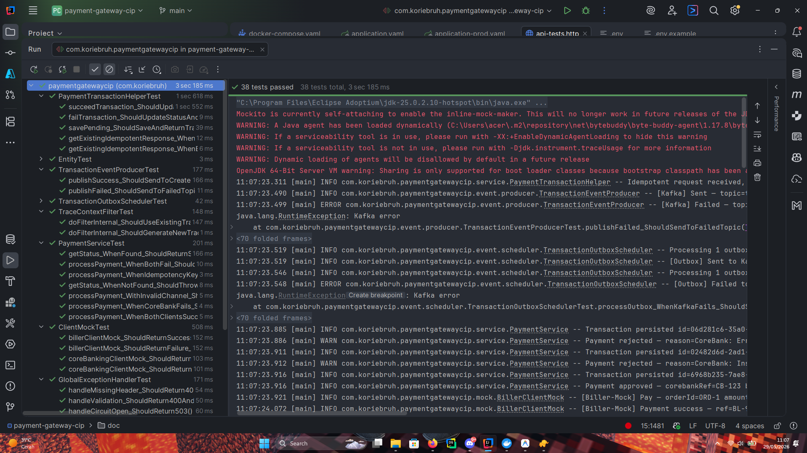
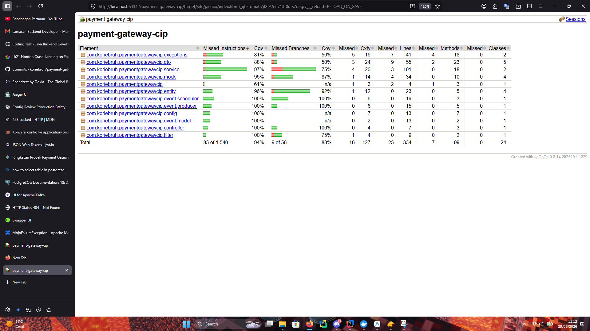

# Payment Gateway CIP

Payment Gateway Service built with Spring Boot to process multi-channel transactions (Mobile Banking, Internet Banking, ATM). It performs balance debits via Core Banking and forwards successful requests to a Biller Aggregator.

## 🚀 Tech Stack
- **Language:** Java 25
- **Framework:** Spring Boot 4
- **Database:** PostgreSQL (JPA/Hibernate)
- **Security:** Keycloak (OAuth2 / JWT Authentication)
- **Messaging:** Apache Kafka
- **Resilience:** Resilience4j (Circuit Breaker)
- **Observability:** OpenTelemetry & Jaeger (Distributed Tracing)
- **Load Testing:** Grafana k6
- **Deployment:** Docker & Docker Compose (Multi-stage build)

## 🛠️ How to Run

1. Clone this repository.
2. Ensure you have Docker and Docker Compose installed.
3. Start the infrastructure and application:
   ```bash
   docker compose up -d --build
   ```
4. Access the services:
   - **Application API:** `http://localhost:8080/api`
   - **API Documentation (Swagger UI):** `http://localhost:8080/api/swagger-ui.html`
   - **Keycloak Admin Console:** `http://localhost:8081`
   - **Jaeger UI:** `http://localhost:16686`
   - **Kafka UI:** `http://localhost:8090`

## 🌟 Improvements & Best Practices Implemented
Beyond the standard requirements provided in the assessment, this project implements several enterprise-grade patterns:

### 1. Observability with Jaeger & OpenTelemetry
Every request is tracked across the system using OpenTelemetry. Traces are exported to Jaeger via OTLP, making it incredibly easy to debug bottlenecks and trace asynchronous flows (like Kafka events).

### 2. Redesigned API Response Payload
The standard response payload was enhanced to include a `trace_id` and standardized error structures. This allows clients to easily report issues and developers to quickly find the exact trace in Jaeger.
```json
{
  "timestamp": "2026-05-29T03:48:54.609",
  "trace_id": "37f6a163e605403ec5ae627bc3b38a42",
  "status": "SUCCESS",
  "message": "Payment processed",
  "data": { ... }
}
```

### 3. Outbox Pattern with Kafka
Instead of sending messages directly to Kafka (which can cause data inconsistency during DB transaction rollbacks), the **Transactional Outbox Pattern** is used. Database commits and Kafka event publishing are guaranteed to be strictly consistent.

### 4. Circuit Breaker (Resilience4j)
Integrated Resilience4j Circuit Breaker for the Biller Aggregator and Core Banking HTTP calls. If the external services are down, the circuit opens, preventing cascading failures and fast-failing requests.

### 5. Load Testing (K6)
Robust load testing scripts (`k6_test.js`) are provided to simulate concurrent users (VUs) and measure throughput (RPS), ensuring the application performs flawlessly under heavy loads.



### 6. High Unit Test Coverage
Comprehensive unit tests covering edge cases, exceptions, and core business logic, achieving high branch coverage.



